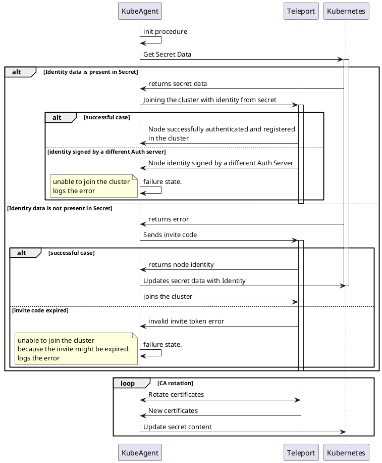

# RFD 73 - Teleport Kube-Agent credential storage in Kubernetes Native Secrets

## What

Teleport Kubernetes Agent support for dynamic short-lived tokens relying only on native Kubernetes Secrets for identity storage.

### Related issues

- [#5585](https://github.com/gravitational/teleport/issues/5585)

## Why

When a Teleport Agent wants to join a Teleport Cluster, it needs to share the invite token with the cluster for initial authentication. The invite token can be:

- Short-lived token (the token will expire after a low TTL and cannot be reused after that time).
- Long-lived/static token (the usage of long-lived tokens is discouraging for security reasons).

After sharing the invite token with the Teleport cluster, the agent receives its identity from the Auth service. Identity certificates are mandatory for accessing the Teleport Cluster and must be stored for accesses without reusing the invite token.

Kubernetes Pods are, by definition, expected to be stateless. This means that each time a Pod is recycled because it was restarted, deleted, upgraded, or moved to another node, the state that was written to its filesystem is lost.

One way to overcome this problem is to use Persistent Volumes. PV is a Kubernetes feature that mounts a storage volume in the container filesystem, whose lifecycle is independent of the Pod that mounts it. Kubernetes’ PV storage has its own drawbacks. Persistent Volumes are very distinct between different cloud vendors. Some providers lock volumes to be mounted in the same zone they were created, meaning that if Teleport agent Pod is recycled, it must be maintained in the same zone it was created. This creates operational issues and for on-premises deployments might be difficult to manage.

Another possibility is that the agent might use the invite token each time the pod is recycled, meaning that it issues a join request to the cluster every time it starts and receives a new identity from the Auth service. This means that the invite token must be a static/long-lived token, otherwise after a while the agent could not register himself in the cluster because the invite token expired. This approach is not recommended and might cause security flaws because the join token can be stolen or guessed.

One solution that might address all the issues referenced above is to allow the agent to use Kubernetes secrets as storage backend. This allows not only that the agent is able to run stateless depending only on native objects generally available in any Kubernetes cluster, but also that the agent might support dynamic short-lived invite tokens with no dependency on external storage.

## Details

### Secret creation and lifecycle

The agent creates, reads and updates the Kubernetes Secrets.

The agent will never issue a delete request to destroy the secret. Helm’s `post-delete` hook achieves this once the operator executes `helm uninstall`.

#### Secret content

Once agent updates the secret, it will have the following structure:

```yaml
apiVersion: v1
data: |
        {
            # {role} might be kube, app,... if multiple roles are defined for the agent then, 
            multiple entries are created each one holding its identity
            "/ids/{role}/current": {
                "kind": "identity",
                "version": "v2",
                "metadata": {
                    "name": "current"
                },
                "spec": {
                    "key": "{key_content}",
                    "ssh_cert": "{ssh_cert_content}",
                    "tls_cert": "{tls_cert_content}",
                    "tls_ca_certs": ["{tls_ca_certs}"],
                    "ssh_ca_certs": ["{ssh_ca_certs}"]
                }
            }

             # State is important if restart/rollback happens during the CA rotation phase.
             # it holds the current status of the rotation
            "/states/{role}/state": {
                "kind": "state",
                "version": "v2",
                ...
            }
            
            # during CA rotation phase, the new keys are stored if agent is restarted or rotation has to rollback
            "/ids/{role}/replacement": {
                "kind": "identity",
                "version": "v2",
                "metadata": {
                    "name": "replacement"
                },
                "spec": {
                    "key": "{key_content}",
                    "ssh_cert": "{ssh_cert_content}",
                    "tls_cert": "{tls_cert_content}",
                    "tls_ca_certs": ["{tls_ca_certs}"],
                    "ssh_ca_certs": ["{ssh_ca_certs}"]
                }
            }
        }
    
kind: Secret
metadata:
  name: {.Release.Name}-identity-{{$TELEPORT_REPLICA_NAME}}
  namespace: {.Release.Namespace}
```

Where:

- `ssh_cert` is a PEM encoded SSH host cert.
- `key` is a PEM encoded private key.
- `tls_cert` is a PEM encoded x509 client certificate.
- `tls_ca_certs` is a list of PEM encoded x509 certificate of the certificate authority of the cluster.
- `ssh_ca_certs` is a list of SSH certificate authorities encoded in the authorized_keys format.
- `role` is the role the agent is operating. If agent is running with multiple roles, i.e. app, kube..., multiple entries will be added, one for each role.
- `TELEPORT_REPLICA_NAME` is the teleport agent replica name. Constant when using Deployments, `TELEPORT_REPLICA_NAME={{ .Release.Name}}` or dynamic when using Statefulsets, `TELEPORT_REPLICA_NAME=metadata.name`.

#### RBAC Changes

The Teleport agent service account must be able to create, read and update secrets within the namespace, therefore, one must create a new namespace role and attach it to the agent service account with the following content:

```yaml
- apiGroups: [""]
  # objects is "secrets"
  resources: ["secrets"]
  verbs: ["create"] # create must have a special case in RBAC since we cannot block creation of the secret based on resource name.
- apiGroups: [""]
  # objects is "secrets"
  resources: ["secrets"]
  resourcesNames: 
  - "{.Release.Name}-identity-{{$TELEPORT_REPLICA_NAME}}" # initial secrets
  - ... # other identities if # replicas is higher than 1
  verbs: ["get", "update","watch", "list"]
```

The RBAC only allows the service account to read and update the secrets listed under `resourceNames` entry. The `create` verb must be handled in a separate case because during the authorization process, Kubernetes does not know the resource name and cannot allow its creation [[rbac]].

### Teleport Changes

#### Kube Secret as storage backend

If secret storage is enabled, the Teleport agent initializes with Kubernetes secret [backend storage](https://goteleport.com/docs/setup/reference/backends/). The backend storage availability for Teleport will be the following:

| Data type | Description | Supported storage backends |
|---|---|---|
| core cluster state | Cluster configuration (e.g. users, roles, auth connectors) and identity (e.g. certificate authorities, registered nodes, trusted clusters). | Local directory (SQLite), etcd, AWS DynamoDB, GCP Firestore, self-hosted PostgreSQL/CockroachDB (Preview) |
| audit events | JSON-encoded events from the audit log (e.g. user logins, RBAC changes) | Local directory, AWS DynamoDB, GCP Firestore |
| session recordings | Raw terminal recordings of interactive user sessions | Local directory, AWS S3 (and any S3-compatible product), GCP Cloud Storage |
| teleport instance state | ID and credentials of a non-auth teleport instance (e.g. node, proxy, kube) | Local directory or Kube Secret if running in kube |

The storage backend will be responsible for managing the Kubernetes secret, i.e. reading and updating its contents, in order to create a transparent storage backend.

If the identity secret exists in Kubernetes and has the node identity on it, the storage engine will parse and return the keys to the Agent, so it can use them to authenticate in the Teleport Cluster. If the cluster access operation is successful, the agent will be available for usage, but if the access operation fails because the Teleport Auth does not validate the node credentials, the Agent will log an error providing insightful information about the failure cause.

In case of the identity secret does not exist or is empty, the agent will try to join the cluster with the invite token provided. If the invite token is valid (has details in the Teleport Cluster and did not expire yet), Teleport Cluster will reply with the agent identity. Given the identity, the agent will write it in the secret `{{ .Release.Name }}-identity-{{$TELEPORT_REPLICA_NAME}}` for future usage.

Otherwise, if the invite token is not valid or has expired, the Agent could not join the cluster, and it will stop and log a meaningful error message.

The following diagram shows the behavior when using Kubernetes’ Secret backend storage.

```text
                                                              ┌─────────┐                                        ┌────────┐          ┌──────────┐                    
                                                              │KubeAgent│                                        │Teleport│          │Kubernetes│                    
                                                              └────┬────┘                                        └───┬────┘          └────┬─────┘                    
                                                                   ────┐                                             │                    │                          
                                                                       │ init procedure                              │                    │                          
                                                                   <───┘                                             │                    │                          
                                                                   │                                                 │                    │                          
                                                                   │                          Get Secret Data        │                   ┌┴┐                         
                                                                   │────────────────────────────────────────────────────────────────────>│ │                         
                                                                   │                                                 │                   │ │                         
                                                                   │                                                 │                   │ │                         
         ╔══════╤══════════════════════════════════════════════════╪═════════════════════════════════════════════════╪═══════════════════╪═╪════════════════════════╗
         ║ ALT  │  Identity data is present in Secret              │                                                 │                   │ │                        ║
         ╟──────┘                                                  │                                                 │                   │ │                        ║
         ║                                                         │                        returns secret data      │                   │ │                        ║
         ║                                                         │<─ ─ ─ ─ ─ ─ ─ ─ ─ ─ ─ ─ ─ ─ ─ ─ ─ ─ ─ ─ ─ ─ ─ ─ ─ ─ ─ ─ ─ ─ ─ ─ ─ ─ │ │                        ║
         ║                                                         │                                                 │                   │ │                        ║
         ║                                                         │ Joining the cluster with identity from secret  ┌┴┐                  │ │                        ║
         ║                                                         │───────────────────────────────────────────────>│ │                  │ │                        ║
         ║                                                         │                                                │ │                  │ │                        ║
         ║                                                         │                                                │ │                  │ │                        ║
         ║                   ╔══════╤══════════════════════════════╪════════════════════════════════════════════════╪═╪═════════════╗    │ │                        ║
         ║                   ║ ALT  │  successful case             │                                                │ │             ║    │ │                        ║
         ║                   ╟──────┘                              │                                                │ │             ║    │ │                        ║
         ║                   ║                                     │Node successfully authenticated and registered  │ │             ║    │ │                        ║
         ║                   ║                                     │in the cluster                                  │ │             ║    │ │                        ║
         ║                   ║                                     │<─ ─ ─ ─ ─ ─ ─ ─ ─ ─ ─ ─ ─ ─ ─ ─ ─ ─ ─ ─ ─ ─ ─ ─│ │             ║    │ │                        ║
         ║                   ╠═════════════════════════════════════╪════════════════════════════════════════════════╪═╪═════════════╣    │ │                        ║
         ║                   ║ [identity signed by a different Auth server]                                         │ │             ║    │ │                        ║
         ║                   ║                                     │Node identity signed by a different Auth Server │ │             ║    │ │                        ║
         ║                   ║                                     │<─ ─ ─ ─ ─ ─ ─ ─ ─ ─ ─ ─ ─ ─ ─ ─ ─ ─ ─ ─ ─ ─ ─ ─│ │             ║    │ │                        ║
         ║                   ║                                     │                                                │ │             ║    │ │                        ║
         ║                   ║      ╔════════════════════════════╗ ────┐                                            │ │             ║    │ │                        ║
         ║                   ║      ║unable to join the cluster ░║     │ failure state.                             │ │             ║    │ │                        ║
         ║                   ║      ║logs the error              ║ <───┘                                            │ │             ║    │ │                        ║
         ║                   ╚══════╚════════════════════════════╝═╪════════════════════════════════════════════════╪═╪═════════════╝    │ │                        ║
         ╠═════════════════════════════════════════════════════════╪═════════════════════════════════════════════════════════════════════╪═╪════════════════════════╣
         ║ [Identity data is not present in Secret]                │                                                 │                   │ │                        ║
         ║                                                         │                           returns error         │                   │ │                        ║
         ║                                                         │<─ ─ ─ ─ ─ ─ ─ ─ ─ ─ ─ ─ ─ ─ ─ ─ ─ ─ ─ ─ ─ ─ ─ ─ ─ ─ ─ ─ ─ ─ ─ ─ ─ ─ │ │                        ║
         ║                                                         │                                                 │                   │ │                        ║
         ║                                                         │               Sends invite code                ┌┴┐                  │ │                        ║
         ║                                                         │───────────────────────────────────────────────>│ │                  │ │                        ║
         ║                                                         │                                                │ │                  │ │                        ║
         ║                                                         │                                                │ │                  │ │                        ║
         ║         ╔══════╤════════════════════════════════════════╪════════════════════════════════════════════════╪═╪══════════════════╪═╪══════════════╗         ║
         ║         ║ ALT  │  successful case                       │                                                │ │                  │ │              ║         ║
         ║         ╟──────┘                                        │                                                │ │                  │ │              ║         ║
         ║         ║                                               │             returns node identity              │ │                  │ │              ║         ║
         ║         ║                                               │<─ ─ ─ ─ ─ ─ ─ ─ ─ ─ ─ ─ ─ ─ ─ ─ ─ ─ ─ ─ ─ ─ ─ ─│ │                  │ │              ║         ║
         ║         ║                                               │                                                │ │                  └┬┘              ║         ║
         ║         ║                                               │                  Updates secret data with Identity                   │               ║         ║
         ║         ║                                               │─────────────────────────────────────────────────────────────────────>│               ║         ║
         ║         ║                                               │                                                │ │                   │               ║         ║
         ║         ║                                               │               joins the cluster                │ │                   │               ║         ║
         ║         ║                                               │───────────────────────────────────────────────>│ │                   │               ║         ║
         ║         ╠═══════════════════════════════════════════════╪════════════════════════════════════════════════╪═╪═══════════════════╪═══════════════╣         ║
         ║         ║ [invite code expired]                         │                                                │ │                   │               ║         ║
         ║         ║                                               │          invalid invite token error            │ │                   │               ║         ║
         ║         ║                                               │<─ ─ ─ ─ ─ ─ ─ ─ ─ ─ ─ ─ ─ ─ ─ ─ ─ ─ ─ ─ ─ ─ ─ ─│ │                   │               ║         ║
         ║         ║                                               │                                                │ │                   │               ║         ║
         ║         ║      ╔══════════════════════════════════════╗ ────┐                                            │ │                   │               ║         ║
         ║         ║      ║unable to join the cluster           ░║     │ failure state.                             │ │                   │               ║         ║
         ║         ║      ║because the invite might be expired.  ║ <───┘                                            │ │                   │               ║         ║
         ║         ║      ║logs the error                        ║ │                                                │ │                   │               ║         ║
         ║         ╚══════╚══════════════════════════════════════╝═╪════════════════════════════════════════════════╪═╪═══════════════════╪═══════════════╝         ║
         ╚═════════════════════════════════════════════════════════╪══════════════════════════════════════════════════════════════════════╪═════════════════════════╝
                                                                   │                                                 │                    │                          
                                                                   │                                                 │                    │                          
                                                    ╔═══════╤══════╪═════════════════════════════════════════════════╪════════════════════╪═══════════════╗          
                                                    ║ LOOP  │  CA  rotation                                          │                    │               ║          
                                                    ╟───────┘      │                                                 │                    │               ║          
                                                    ║              │              Rotate certificates                │                    │               ║          
                                                    ║              │<───────────────────────────────────────────────>│                    │               ║          
                                                    ║              │                                                 │                    │               ║          
                                                    ║              │                New certificates                 │                    │               ║          
                                                    ║              │<─ ─ ─ ─ ─ ─ ─ ─ ─ ─ ─ ─ ─ ─ ─ ─ ─ ─ ─ ─ ─ ─ ─ ─ │                    │               ║          
                                                    ║              │                                                 │                    │               ║          
                                                    ║              │                     Update secret content       │                    │               ║          
                                                    ║              │─────────────────────────────────────────────────────────────────────>│               ║          
                                                    ╚══════════════╪═════════════════════════════════════════════════╪════════════════════╪═══════════════╝          
                                                              ┌────┴────┐                                        ┌───┴────┐          ┌────┴─────┐                    
                                                              │KubeAgent│                                        │Teleport│          │Kubernetes│                    
                                                              └─────────┘                                        └────────┘          └──────────┘                    
```

### Backend storage

Kubernetes Secret storage will be a transparent backend storage that can be plugged into [`ProcessStorage`](https://github.com/gravitational/teleport/blob/1aa38f4bc56997ba13b26a1ef1b4da7a3a078930/lib/auth/state.go#L35) structure. Currently, `ProcessStorage` is responsible for handling the Identity and State storage. It expects a [`backend.Backend`](https://github.com/gravitational/teleport/blob/cc27d91a4585b0d744a7bec110260c335b0007fd/lib/backend/backend.go#L42), but it only requires a subset of it. The idea is to define a new interface `IdentityBackend` with the required methods and use it.

```go
// ProcessStorage is a backend for local process state,
// it helps to manage rotation for certificate authorities
// and keeps local process credentials - x509 and SSH certs and keys.
type ProcessStorage struct {
	IdentityBackend
}

// IdentityBackend implements abstraction over local or remote storage backend methods
// required for Identity/State storage.
// As in backend.Backend, Item keys are assumed to be valid UTF8, which may be enforced by the
// various Backend implementations.
type IdentityBackend interface {
	// Create creates item if it does not exist
	Create(ctx context.Context, i backend.Item) (*backend.Lease, error)
	// Put puts value into backend (creates if it does not
	// exists, updates it otherwise)
	Put(ctx context.Context, i backend.Item) (*backend.Lease, error)
	// Get returns a single item or not found error
	Get(ctx context.Context, key []byte) (*backend.Item, error)
	// Close closes backend and all associated resources
	Close() error
}
```

During the startup procedure, the agent identifies that it is running inside Kubernetes. The identification can be achieved by checking the presence of the service account mount path `/var/run/secrets/kubernetes.io`. Although Kubernetes has an option that can disable this mount path, `automountServiceAccountToken: false`, this option is always enabled in our helm chart since we require it for handling the secrets.

If the agent detects that it is running in Kubernetes, it instantiates a backend for Kubernetes Secret. This backend creates a client with configuration provided by `restclient.InClusterConfig()`, which uses the service account token mounted in the pod. With this, the agent can operate the secret by creating, updating, and reading the secret data. To prevent multiple agents from racing each other when writing in the secret, the Kubernetes Storage engine might use the resource lock feature from Kubernetes (`resourceVersion`) to implement optimistic locking.

For a compatibility layer, if the secret does not exist in Kubernetes, but locally we have the SQLite database, this means storage is enabled, and the agent had already joined the cluster in the past. Hereby, the agent can inherit the credentials stored in the database and write them in Kubernetes secret, destroying the SQLite after ([more details](#upgrade-plans-from-pre-rfd-to-pos-rfd)).

The storage must also store the events of type `kind=state` since they are used during the CA rotation phase. They are helpful if the pod restarts, and has to rollback to the previous identity or finish the process and replace the old identity with the new one.

### CA Rotation

CA rotation feature allows the cluster operator to force the cluster to recreate and re-issue certificates for users and agents. During this procedure, agents and users receive the new keys signed by the newest CA from Teleport Auth.

While the cluster is transitioning, the keys signed by the old CA are considered valid in order for the agent to be able to receive its new identity certificates from Teleport Auth. During the whole process, the CA rotation can be rollbacked, and if this happens the new certificate becomes invalid. This action can happen because another agent has issues or by decision of the operator. Given this, the new identity keys and old identity keys must be stored separately in the Secret until the rotation process finishes successfully.

Once the new identity is received by the agent, it will store its state, indicating it is under a rotation event, and the new identity in the secret. The state under `/states/{role}/state` and the identity under `/ids/{role}/replacement`. This is mandatory so the pod, after restart, can resume the operation if not finished yet. If the process fails, the state is rewritten in order to inform the rotation has finished. Otherwise, if the process finishes successfully the process will replace the identity under `/states/{role}/current` with the new identity and replace the state content.

### Upgrade from PRE-RFD versions

When upgrading from PRE-RFD into versions that implement this RFD, we have three scenarios based on pre-existing configuration. They are described in the table below.

| Storage | Replicas >1 | Scenario |
|---|---|---|
| true | false |  (1) |
| true | true |  (1)  |
| false | false | (2) |
| false | true |  (3) |

A description of each case's caveats is available below.

1. Storage is available:  `Statefulset -> Statefulset`
    
    When storage is available, it means that identity and state were previously stored in the local database in PV. This means that the agent is able to read the local file and store that information in a new Kubernetes Secret, deleting the local database once the operation was successful.
    
    Once the secret is stored, the agent no longer requires the PV storage since nothing is stored there. At this point the operator can upgrade the Helm Chart to have `storage.enabled=false`.
    
    A descriptive comment and deprecation must be added to the storage section detailing the upgrade process. First, it's required in order to read the agent identity from local storage, and later it can be disabled.


2. Storage is not available; Replicas = 1:  `Deployment -> Deployment`

    This is the simplest case. Deployments do not keep the local storage across recycle cycles, so the invite token should [^should] be a long-lived/static token. This means that the new agent can join the cluster using the invite token and later create the Secret in Kubernetes for later reuses.

    [^should]: should because it might not be the case, but it will fail anyway since even if the upgrade is not done, a simple restart will result in the agent not being able to join the cluster.

    Later, the operator might invalidate the token in Teleport, so it is not available for reuse.


3. Storage is not available; Replicas > 1:  `Deployment -> Statefulset`

    If storage was not available, Helm chart installed the assets as a Deployment. Due to [limitations](#limitations), the current RFD forces the usage of Statefulset when running in high availability mode. This means that for this case, Helm chart will remove the Deployment and create a Statefulset. Helm manages this change by destroying the Deployment object and creating the new Statefulset. During this transition, even if the operator has the PodDisruptionBudget object enabled, the Kubernetes cluster might become inaccessible from Teleport for some time because there is no guarantee that the system has at least one agent replica running.

    Regarding the invite token, since it was running as deployment, it should be using a long-lived/static token as described in the case above, and it should not create any issue when joining the cluster with that invite token if it is still valid.


### Limitations

High availability can only be achieved using Statefulsets and not Deployments. This means that if the desired number of replicas is bigger than one, i.e, `replicas > 1`, the [Helm chart](https://github.com/gravitational/teleport/tree/master/examples/chart/teleport-kube-agent) has to switch to Statefulset objects instead of Deployments. This change is required because at least one invariant must be kept across restarts to correctly map each agent pod and its identity Secret. The invariant used is the Statefulset pod name `{{ .Release.Name }}-{0...replicas}}`.

Given this, it is required to expose the `$TELEPORT_REPLICA_NAME` environment variable to each pod in order to the backend storage be able to write the identity separately. The values for `$TELEPORT_REPLICA_NAME` are dependent on the object type:

- Deployment: `TELEPORT_REPLICA_NAME` is a constant string `{{ .Release.Name }}`.
- Statefulset: `TELEPORT_REPLICA_NAME` is a dynamic value provided by Kubernetes `fieldPath: metadata.name`.

Another limitation appears when the operator wants to increase the number of replicas. It is a requirement that they must execute the upgrade process through Helm. If the operator does a manual increase of the number of replicas by editing the Kubernetes objects, it will cause the following limitations, depending on the object type:

- `Deployment`: all agents will use the same identity when accessing the cluster.
- `Statefulset`: some replicas might fail to start. They will try to join the cluster again because they cannot read their secrets. This happens because each replica will have its own identity secret and RBAC only lists access rules to some of them, resulting in some pods not being able to read the secrets, and eventually they will trigger the cluster invitation process each time they restart.

### Helm Chart Differences

#### File *templates/config.yaml*

```diff
{{- $logLevel := (coalesce .Values.logLevel .Values.log.level "INFO") -}}
{{- if .Values.teleportVersionOverride -}}
  {{- $_ := set . "teleportVersion" .Values.teleportVersionOverride -}}
{{- else -}}
  {{- $_ := set . "teleportVersion" .Chart.Version -}}
{{- end -}}
apiVersion: v1
kind: ConfigMap
metadata:
  name: {{ .Release.Name }}
  namespace: {{ .Release.Namespace }}
{{- if .Values.extraLabels.config }}
  labels:
  {{- toYaml .Values.extraLabels.config | nindent 4 }}
{{- end }}
  {{- if .Values.annotations.config }}
  annotations:
    {{- toYaml .Values.annotations.config | nindent 4 }}
  {{- end }}
data:
  teleport.yaml: |
    teleport:
      auth_token: "/etc/teleport-secrets/auth-token"
      auth_servers: ["{{ required "proxyAddr is required in chart values" .Values.proxyAddr }}"]
```

#### File *templates/deployment.yaml*

```diff
#
# Warning to maintainers, any changes to this file that are not specific to the Deployment need to also be duplicated
# in the statefulset.yaml file.
#
-{{- if not .Values.storage.enabled }}
{{- $replicaCount := (coalesce .Values.replicaCount .Values.highAvailability.replicaCount "1") }}
+{{- if and (not .Values.storage.enabled) (eq $replicaCount 1) }}
...
-        {{- if .Values.extraEnv }}
-        env:
-          {{- toYaml .Values.extraEnv | nindent 8 }}
-        {{- end }}
+        env:
+          - name: TELEPORT_REPLICA_NAME
+            value: {{ .Release.Name }}
+         {{- if .Values.extraEnv }}
+          {{- toYaml .Values.extraEnv | nindent 8 }}
+        {{- end }}
```

#### File *templates/statefulset.yaml*

```diff
#
# Warning to maintainers, any changes to this file that are not specific to the StatefulSet need to also be duplicated
# in the deployment.yaml file.
#
-{{- if .Values.storage.enabled }}
{{- $replicaCount := (coalesce .Values.replicaCount .Values.highAvailability.replicaCount "1") }}
+{{- if or (.Values.storage.enabled) (ne $replicaCount 1) }}
...
-        {{- if .Values.extraEnv }}
-        env:
-          {{- toYaml .Values.extraEnv | nindent 8 }}
-        {{- end }}
+        env:
+          - name: TELEPORT_REPLICA_NAME
+            valueFrom:
+              fieldRef:
+                 fieldPath: metadata.name
+         {{- if .Values.extraEnv }}
+          {{- toYaml .Values.extraEnv | nindent 10 }}
+        {{- end }}

# remove PV storage if storage is not enabled
...
+{{- if .Values.storage.enabled }}
        - mountPath: /var/lib/teleport
          name: "{{ .Release.Name }}-teleport-data"
+{{- end }}
...
+{{- if .Values.storage.enabled }}
  volumeClaimTemplates:
  - metadata:
      name: "{{ .Release.Name }}-teleport-data"
    spec:
      accessModes: [ "ReadWriteOnce" ]
      storageClassName: {{ .Values.storage.storageClassName }}
      resources:
        requests:
          storage: {{ .Values.storage.requests }}
+{{- end }}
{{- end }}
```

#### File *values.yaml*

Change storage comments

## Installation

If the agent detects that it is running inside Kubernetes, it will enable, by default, the Kube secret storage. This means that there is no change to the end user.

```bash
$ helm install teleport-kube-agent . \
  --create-namespace \
  --namespace teleport \
  --set roles=kube \
  --set proxyAddr=${PROXY_ENDPOINT?} \
  --set authToken=${JOIN_TOKEN?} \
  --set kubeClusterName=${KUBERNETES_CLUSTER_NAME?}
```

# Links
[rbac]: https://kubernetes.io/docs/reference/access-authn-authz/rbac/
- [1] https://kubernetes.io/docs/reference/access-authn-authz/rbac/


<!-- Plant UML diagrams -->
<!--


-->